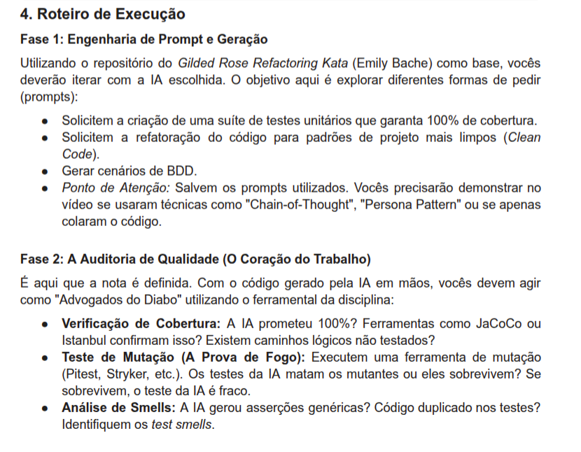
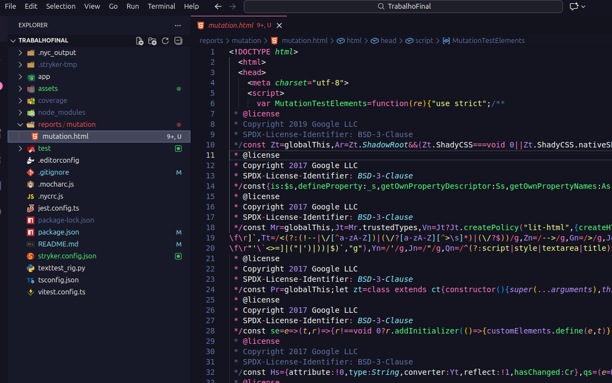
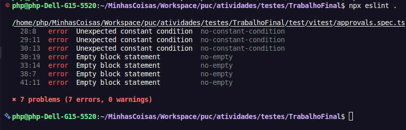
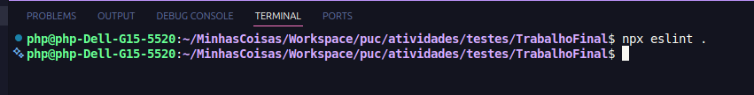

# JULIA LEIA!

## Instale as depêndencias

```
npm install
```


## Sua parte




## Link do PDF

Não precisa mas se quiser ler o pdf completo [clique aqui](assets/TP-Final.pdf)


## A Auditoria de Qualidade (O Coração do Trabalho)

Aqui vou explicar como conseguir cada informação para a realização da fase 2 do trabalho

### Verificação de Cobertura

Há muitas forma de analisar cobertura eu pessoalmente iria pelo número de linhas
ou de branchs cobertas. Mas pode escolher qualquer uma delas, mas resuminto

* **Stmts:** se refere ao número de instruções executadas, como a = 10; ou if (b == 5)
* **Branch:** se refere as condicionais, se ouve ao menos uma vez que nos testes ela foi dada como falso e pelo menos uma vez que foi dada como verdadeiro
* **Funcs:** é 100% caso todas as funções tenham sido chamadas ao menos uma vez
* **Lines:** se refere ao númerode linhas executadas.

*Veja o exemplo abaixo*

| File            | % Stmts | % Branch | % Funcs | % Lines | Uncovered Line #s |
|-----------------|---------|----------|---------|---------|-------------------|
| All files       | 48.38   | 25.71    | 100     | 46.66   |                   |
| gilded-rose.ts  | 48.38   | 25.71    | 100     | 46.66   | 24-39, 52-61      |


Essa tabela é gerada sempre que rodar 

```
npm run test
```

é assim que vai obter a cobertura


## Teste de Mutação (A Prova de Fogo):

Para executar os testes de mutação basta rodar

```
npx stryker run
```

**MAS ATENÇÃO:** *o stryker só vai funcionar se todos os testes estiverem passando, se ao menos um ainda estiver quebrando ele vai dar erro.*

Ao rodar abra o `mutation.html` que estara na pasta reports que sera criada ao executar o comando. Lá vc vera informações sobre cobertura, mutantes mortos e sobreviventes.




## Análise de Smells

Por ultimo, para a análise de Smells usaremos o eslint

```
npx eslint .
```

Ao rodar o comando devem aparecer erros como este



Ou mesno nada como aqui



Em um projeto real a segunda opção seria melhor mas já que a ideia aqui é avalidar a qualidade do trabalho da IA, independente do resultado, contanto que registrado esta ótimo.